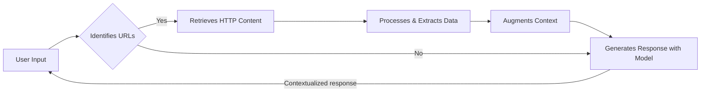
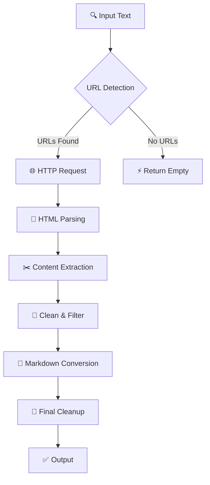

# 📝 Markdown Harvest

<div align="center">
  
  
  [](https://crates.io/crates/markdown-harvest)
  [](https://docs.rs/markdown-harvest)
  [](https://opensource.org/licenses/MIT)
  [](https://www.rust-lang.org/)
</div>

<br>

A Rust crate designed to extract, clean, and convert web content from URLs found in text messages into clean Markdown format. Originally created as an auxiliary component for Retrieval-Augmented Generation (RAG) solutions to process URLs submitted by users.

## 📋 Table of Contents

- [Overview](#overview)
- [Features](#features)
- [Quick Start](#quick-start)
- [Installation](#installation)
- [Usage Examples](#usage-examples)
- [API Documentation](#api-documentation)
- [Content Processing Pipeline](#content-processing-pipeline)
- [Supported Platforms](#supported-platforms)
- [Contributing](#contributing)
- [License](#license)
- [Changelog](#changelog)

## Overview

Markdown Harvest was initially developed as part of a Retrieval-Augmented Generation (RAG) system where users submit text containing URLs, and the system needs to extract meaningful content from those URLs for further analysis or processing. This crate handles the extraction, cleaning, and structuring of web content automatically.

### 🎯 Why Markdown Harvest?

- **🚀 Built for AI/RAG Systems**: Specifically designed for content preprocessing in AI workflows
- **🧹 Smart Content Extraction**: Removes ads, navigation, and irrelevant elements automatically
- **📝 Markdown Output**: Clean, structured Markdown perfect for LLM processing
- **🔄 Batch Processing**: Handle multiple URLs efficiently in a single operation
- **🛡️ Robust Error Handling**: Gracefully handles network issues and invalid URLs

## Use Case Process Flow



## ✨ Features

- **🔍 URL Detection**: Automatically identifies HTTP/HTTPS URLs in text using regex patterns
- **🎯 Smart Content Extraction**: Extracts only relevant content from HTML `<body>` elements
- **📄 HTML to Markdown Conversion**: Converts HTML content to clean, readable Markdown while preserving structure and removing unwanted elements
- **🧹 Content Cleaning**: Removes JavaScript, CSS, advertisements, and navigation elements
- **🤖 Multi-Platform User Agents**: Rotates between different browser user agents to avoid detection
- **⚡ Async/Blocking Support**: Choose between async and blocking HTTP requests
- **🛡️ Error Handling**: Graceful handling of network errors and invalid URLs
- **📝 Clean Text Output**: Normalizes whitespace and removes common non-content patterns

## 🚀 Quick Start

```rust
use markdown_harvest::MarkdownHarvester;

fn main() {
    let text = "Check this out: https://example.com/article";
    let results = MarkdownHarvester::get_hyperlinks_content(text.to_string());
    
    for (url, content) in results {
        println!("URL: {}\nContent: {}", url, content);
    }
}
```

## 📦 Installation

Add this to your `Cargo.toml`:

```toml
[dependencies]
markdown-harvest = "0.1.0"
```

## 📚 Usage Examples

### 📝 Basic Usage

```rust
use markdown_harvest::MarkdownHarvester;

fn main() {
    let text = "Check out this article: https://example.com/article.html and this one too: https://news.site.com/story";
    
    let results = MarkdownHarvester::get_hyperlinks_content(text.to_string());
    
    for (url, content) in results {
        println!("URL: {}", url);
        println!("Markdown Content:\n{}", content);
        println!("---");
    }
}
```

### 💻 Interactive CLI Mode

The crate provides an interactive CLI mode for testing:

```bash
cargo run
```

Then enter text containing URLs when prompted.

### 🔧 Library Integration
er
```rust
use markdown_harvest::{MarkdownHarvester, UserAgent};

// Use different user agents
let user_agent = UserAgent::random_windows();
println!("Using: {}", user_agent.to_string());

// Process multiple URLs from text
let input = "Articles: https://site1.com and https://site2.com";
let results = MarkdownHarvest::get_hyperlinks_content(input.to_string());
```

## 📖 API Documentation

### Core Functions

```rust
// Main function to extract content from URLs in text
MarkdownHarvester::get_hyperlinks_content(text: String) -> Vec<(String, String)>

// User agent utilities
UserAgent::random_windows() -> String
UserAgent::random_macos() -> String  
UserAgent::random_linux() -> String
UserAgent::random_android() -> String
UserAgent::random_ios() -> String
```

### Supported Platforms & User Agents

The crate includes user agents for:
- **Windows**: Chrome, Firefox, Edge
- **macOS**: Chrome, Safari, Firefox  
- **Linux**: Chrome, Firefox
- **Android**: Chrome, Firefox
- **iOS**: Safari, Chrome

## 🏗️ Dependencies

- **`reqwest`** - HTTP client with blocking support
- **`scraper`** - HTML parsing and CSS selector engine  
- **`html2md`** - Intelligent HTML to Markdown conversion
- **`regex`** - URL detection and content filtering
- **`rand`** - Random user agent selection
- **`tokio`** - Async runtime support

## 🤖 AI Integration Context

This crate was specifically designed to serve as a content extraction component in Retrieval-Augmented Generation (RAG) workflows where:

1. **👥 Users submit messages** containing URLs alongside other text
2. **🧠 AI systems need structured content** from those URLs for analysis  
3. **📝 Clean, readable Markdown is required** preserving essential content and structure while removing HTML markup, scripts, ads, and links
4. **🔄 Multiple URLs need processing** in batch operations
5. **🛡️ Reliability is crucial** with proper error handling and fallbacks

The extracted content can then be fed into language models, search systems, or other AI components for further processing.

### 🎯 Perfect for RAG Systems

- **Vector Database Integration**: Clean Markdown is ideal for embedding generation
- **Token Optimization**: Removes unnecessary content to reduce token usage
- **Batch Processing**: Handle multiple URLs from user queries efficiently
- **Content Quality**: Preserves semantic structure while removing noise

## ⚙️ Markdown Transformation Details

The crate performs intelligent HTML to Markdown conversion that preserves essential formatting while removing clutter:

### ✅ **Preserved Elements**
- **Headers**: `<h1>` → `# Header`, `<h2>` → `## Header`
- **Emphasis**: `<strong>` → `**bold**`, `<em>` → `*italic*`  
- **Lists**: `<ul><li>` → `- item`, `<ol><li>` → `1. item`
- **Blockquotes**: `<blockquote>` → `> quote text`
- **Scientific names**: `<i>Bertholletia excelsa</i>` → `*Bertholletia excelsa*`

### ❌ **Removed Elements**
- **Links**: `[text](url)` → `text` (keeps text, removes URL)
- **Images**: `` tags completely removed
- **Media**: `<iframe>`, `<video>`, `<audio>` elements stripped
- **Navigation**: `<nav>`, `<header>`, `<footer>`, `<aside>` sections
- **Metadata**: Author bylines, publication dates, tag lists
- **Advertisements**: Elements with ad-related classes or IDs

### 🧹 **Text Cleanup**
- Normalizes excessive whitespace and line breaks
- Removes photo captions and image attribution text
- Filters out navigation phrases ("click here", "read more")
- Eliminates code blocks and technical markup
- Preserves paragraph structure and readability

## 🔄 Content Processing Pipeline



1. **🔍 Input**: Raw text from user containing URLs
2. **🎯 Detection**: Regex-based URL extraction with punctuation cleanup
3. **🌐 Fetching**: HTTP requests with randomized user agents
4. **📄 HTML Parsing**: Document parsing with scraper crate
5. **✂️ Body Extraction**: Extracts only content from HTML `<body>` element
6. **🚫 Media Removal**: Strips images, iframes, videos, and other non-textual elements
7. **🧹 Structure Cleaning**: Removes scripts, styles, navigation, headers, footers, and ads
8. **🎯 Content Selection**: Focuses on relevant elements (articles, main content, headings, paragraphs)
9. **📝 Markdown Conversion**: Transforms cleaned HTML to structured Markdown using html2md
10. **🔗 Link Processing**: Converts `[text](url)` links to plain text, removes standalone URLs
11. **✨ Format Preservation**: Maintains headers, bold, italic, lists, and blockquotes
12. **🔧 Final Cleanup**: Removes metadata, navigation text, and excessive whitespace
13. **✅ Output**: Clean, readable Markdown content paired with source URLs

## ⚠️ Error Handling

The crate handles various error conditions gracefully:
- 🌐 Network timeouts and connection errors
- 🔗 Invalid or malformed URLs
- 📄 Empty or missing content  
- 🚫 Server errors (404, 500, etc.)
- 🛡️ Blocked requests or rate limiting

## 🤝 Contributing

Contributions are welcome! Here's how to get started:

1. **🍴 Fork** the repository
2. **🔧 Create** a feature branch (`git checkout -b feature/amazing-feature`)
3. **💾 Commit** your changes (`git commit -m 'Add amazing feature'`)
4. **📤 Push** to the branch (`git push origin feature/amazing-feature`)
5. **🔀 Open** a Pull Request

### Development Setup

```bash
# Clone the repository
git clone https://github.com/franciscotbjr/markdown-harvest
cd markdown-harvest

# Run tests
cargo test

# Run the interactive CLI
cargo run

# Format code
cargo fmt

# Check for issues
cargo clippy
```

## 📄 License

Licensed under the **MIT License**. See [LICENSE](LICENSE) for details.

## 📋 Changelog

### v0.1.0
- ✨ Initial release
- 🔍 URL detection and content extraction
- 🤖 Multi-platform user agent support  
- 🧹 Content cleaning and normalization
- 💻 Interactive CLI mode

---

<div align="center">
  <p><strong>Built with ❤️ for RAG systems and AI workflows</strong></p>
  <p>⭐ Star this repo if it helps your project!</p>
</div>