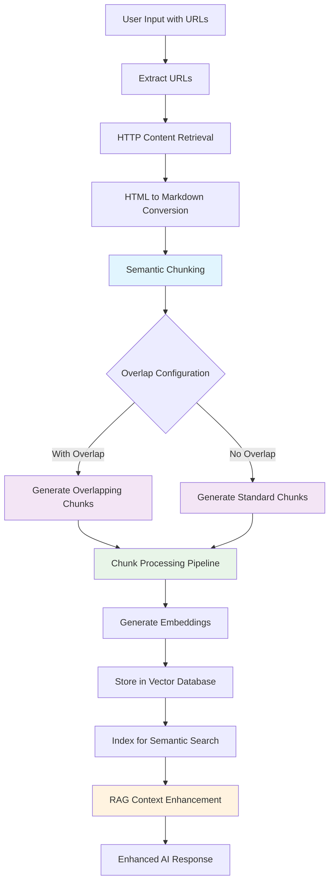

# 📝 Markdown Harvest

<div align="center">
  
  
  [](https://crates.io/crates/markdown-harvest)
  [](https://docs.rs/markdown-harvest)
  [](https://opensource.org/licenses/MIT)
  [](https://www.rust-lang.org/)
</div>

<br>

A Rust crate designed to extract, clean, and convert web content from URLs found in text messages into clean Markdown format. Originally created as an auxiliary component for Retrieval-Augmented Generation (RAG) solutions to process URLs submitted by users.

## 📋 Table of Contents

- [Overview](#overview)
- [Features](#features)
- [Quick Start](#quick-start)
- [Installation](#installation)
- [Usage Examples](#usage-examples)
- [API Documentation](#api-documentation)
- [Content Processing Pipeline](#content-processing-pipeline)
- [Supported Platforms](#supported-platforms)
- [Contributing](#contributing)
- [License](#license)
- [Changelog](#changelog)

## Overview

Markdown Harvest was initially developed as part of a Retrieval-Augmented Generation (RAG) system where users submit text containing URLs, and the system needs to extract meaningful content from those URLs for further analysis or processing. This crate handles the extraction, cleaning, and structuring of web content automatically.

### 🎯 Why Markdown Harvest?

- **🚀 Built for AI/RAG Systems**: Specifically designed for content preprocessing in AI workflows
- **🧹 Smart Content Extraction**: Removes ads, navigation, and irrelevant elements automatically
- **📝 Markdown Output**: Clean, structured Markdown perfect for LLM processing
- **🔄 Batch Processing**: Handle multiple URLs efficiently in a single operation
- **🛡️ Robust Error Handling**: Gracefully handles network issues and invalid URLs

## Use Case Process Flow

### 📄 Standard Content Processing


### 📦 Chunks Feature Process Flow (RAG Systems)


## ✨ Features

- **🔍 URL Detection**: Automatically identifies HTTP/HTTPS URLs in text using regex patterns
- **🎯 Smart Content Extraction**: Extracts only relevant content from HTML `<body>` elements
- **📄 HTML to Markdown Conversion**: Converts HTML content to clean, readable Markdown while preserving structure and removing unwanted elements
- **🧹 Content Cleaning**: Removes JavaScript, CSS, advertisements, and navigation elements
- **📦 Semantic Chunking**: Optional chunks feature for RAG systems using `MarkdownSplitter` with semantic boundaries and configurable overlap
- **🤖 Multi-Platform User Agents**: Rotates between different browser user agents to avoid detection
- **⚡ Configurable HTTP Options**: Customizable timeout, redirect limits, and cookie management
- **🏗️ Builder Pattern API**: Fluent and intuitive configuration with `HttpConfig::builder()`
- **🛡️ Error Handling**: Graceful handling of network errors and invalid URLs
- **📝 Clean Text Output**: Normalizes whitespace and removes common non-content patterns
- **⚡ Asynchronous Processing**: High-performance async/await support for concurrent URL processing
- **🔄 Callback Architecture**: Flexible callback system for real-time result streaming
- **🧪 Comprehensive Testing**: 55+ unit tests with 100% API coverage including async functionality, chunks, and overlap

## 🚀 Quick Start

```rust
use markdown_harvest::{MarkdownHarvester, HttpConfig};

fn main() {
    let text = "Check this out: https://example.com/article";
    let config = HttpConfig::default(); // Use default HTTP configuration
    let results = MarkdownHarvester::get_hyperlinks_content(text.to_string(), config);
    
    for (url, content) in results {
        println!("URL: {}\nContent: {}", url, content);
    }
}
```

## 📦 Installation

Add this to your `Cargo.toml`:

```toml
[dependencies]
markdown-harvest = "0.1.5"

# For RAG systems with semantic chunking and overlap support
markdown-harvest = { version = "0.1.5", features = ["chunks"] }
```

## 📚 Usage Examples

### 📝 Synchronous Processing (Traditional)

```rust
use markdown_harvest::{MarkdownHarvester, HttpConfig};

fn main() {
    let text = "Check out this article: https://example.com/article.html and this one too: https://news.site.com/story";
    
    // Use default configuration
    let config = HttpConfig::default();
    let results = MarkdownHarvester::get_hyperlinks_content(text.to_string(), config);
    
    for (url, content) in results {
        println!("URL: {}", url);
        println!("Markdown Content:\n{}", content);
        println!("---");
    }
}
```

### ⚡ Asynchronous Processing (High Performance)

```rust
use markdown_harvest::{MarkdownHarvester, HttpConfig};
use std::sync::{Arc, Mutex};

#[tokio::main]
async fn main() -> Result<(), Box<dyn std::error::Error>> {
    let text = "Check out: https://example.com and https://httpbin.org/json";
    let config = HttpConfig::builder().timeout(30000).build();
    
    // Collect results in a thread-safe vector
    let results = Arc::new(Mutex::new(Vec::new()));
    let results_clone = results.clone();
    
    let callback = move |url: Option<String>, content: Option<String>| {
        let results = results_clone.clone();
        async move {
            if let (Some(url), Some(content)) = (url, content) {
                let mut results = results.lock().unwrap();
                results.push((url, content));
                println!("✅ Processed URL with {} characters", content.len());
            }
        }
    };
    
    MarkdownHarvester::get_hyperlinks_content_async(text.to_string(), config, callback).await?;
    
    let final_results = results.lock().unwrap();
    println!("📊 Total URLs processed: {}", final_results.len());
    
    Ok(())
}
```

### 🔄 Real-time Processing with Immediate Output

```rust
use markdown_harvest::{MarkdownHarvester, HttpConfig};

#[tokio::main]
async fn main() -> Result<(), Box<dyn std::error::Error>> {
    let text = "Visit https://example.com for more info";
    let config = HttpConfig::default();
    
    // Process and display results immediately as they arrive
    let callback = |url: Option<String>, content: Option<String>| async move {
        match (url, content) {
            (Some(url), Some(content)) => {
                println!("🚀 Processed: {}", url);
                println!("📄 Content length: {} characters", content.len());
                // Save to database, send to API, etc.
            }
            (None, None) => {
                println!("ℹ️ No URLs found in the provided text");
            }
            _ => unreachable!(),
        }
    };
    
    MarkdownHarvester::get_hyperlinks_content_async(text.to_string(), config, callback).await?;
    
    Ok(())
}
```

### 💻 Interactive CLI Mode

The crate provides an interactive CLI mode for testing:

```bash
cargo run
```

Then enter text containing URLs when prompted.

### 🔧 Advanced HTTP Configuration

```rust
use markdown_harvest::{MarkdownHarvester, HttpConfig};

fn main() {
    let text = "Articles: https://site1.com and https://site2.com";
    
    // Custom HTTP configuration with Builder pattern
    let config = HttpConfig::builder()
        .timeout(10000)        // 10 second timeout
        .max_redirect(5)       // Allow up to 5 redirects
        .cookie_store(true)    // Enable cookie storage for sessions
        .build();
    
    let results = MarkdownHarvester::get_hyperlinks_content(text.to_string(), config);
    
    for (url, content) in results {
        println!("Processed: {}", url);
        println!("Content length: {} chars", content.len());
    }
}
```

### 🎯 Different Configuration Examples

```rust
use markdown_harvest::{MarkdownHarvester, HttpConfig};

// Quick timeout for fast responses only
let fast_config = HttpConfig::builder()
    .timeout(3000)  // 3 seconds
    .build();

// Conservative configuration for slow sites
let patient_config = HttpConfig::builder()
    .timeout(30000)     // 30 seconds
    .max_redirect(10)   // More redirects allowed
    .cookie_store(true) // Handle authentication
    .build();

// Use different configs for different scenarios
let urgent_text = "Breaking news: https://news-site.com/urgent";
let deep_text = "Research: https://academic-site.edu/paper";

let urgent_results = MarkdownHarvester::get_hyperlinks_content(urgent_text.to_string(), fast_config);
let research_results = MarkdownHarvester::get_hyperlinks_content(deep_text.to_string(), patient_config);
```

### 📦 Semantic Chunking for RAG Systems (chunks feature)

*Feature gate: `chunks` - Enable with `markdown-harvest = { version = "0.1.5", features = ["chunks"] }`*

The chunks feature provides semantic text splitting optimized for RAG (Retrieval-Augmented Generation) systems using `MarkdownSplitter` with intelligent boundary detection.

#### 🔄 Synchronous Chunking

```rust
use markdown_harvest::{MarkdownHarvester, HttpConfig};

#[cfg(feature = "chunks")]
fn main() {
    let text = "Research these articles: https://example.com/article1 and https://example.com/article2";
    let config = HttpConfig::default();
    let chunk_size = 1000; // 1000 characters per chunk
    
    let results = MarkdownHarvester::get_hyperlinks_content_as_chunks(
        text.to_string(), 
        config, 
        chunk_size,
        Some(100) // 100 characters overlap for better context preservation
    );
    
    for (url, chunks) in results {
        println!("📄 URL: {}", url);
        println!("📦 Generated {} semantic chunks:", chunks.len());
        
        for (i, chunk) in chunks.iter().enumerate() {
            println!("  Chunk {}: {} chars", i + 1, chunk.len());
            println!("  Content: {}\n---", chunk.chars().take(100).collect::<String>());
        }
    }
}
```

#### ⚡ Asynchronous Chunking

```rust
use markdown_harvest::{MarkdownHarvester, HttpConfig};
use std::sync::{Arc, Mutex};

#[cfg(feature = "chunks")]
#[tokio::main]
async fn main() -> Result<(), Box<dyn std::error::Error>> {
    let text = "Process these for RAG: https://docs.example.com https://blog.example.com";
    let config = HttpConfig::builder()
        .timeout(15000)
        .build();
    let chunk_size = 800; // Optimal for embedding models
    
    // Real-time chunk processing for RAG pipeline
    let callback = |url: Option<String>, chunks: Option<Vec<String>>| async move {
        match (url, chunks) {
            (Some(url), Some(chunks)) => {
                println!("🔗 Processing {} chunks from: {}", chunks.len(), url);
                
                for (i, chunk) in chunks.iter().enumerate() {
                    println!("  📦 Chunk {}: {} chars", i + 1, chunk.len());
                    
                    // RAG Pipeline Integration:
                    // 1. Generate embeddings for this semantic chunk
                    // 2. Store in vector database with metadata
                    // 3. Index for semantic search
                    // 4. Preserve document context and structure
                }
            }
            (None, None) => {
                println!("ℹ️ No URLs found in text");
            }
            _ => unreachable!(),
        }
    };
    
    MarkdownHarvester::get_hyperlinks_content_as_chunks_async(
        text.to_string(),
        config,
        chunk_size,
        Some(80), // 80 characters overlap - optimal for embedding models
        callback
    ).await?;
    
    Ok(())
}
```

#### 🧠 Semantic Chunking Benefits

The `MarkdownSplitter` uses intelligent semantic levels for optimal RAG performance:

1. **📊 Heading Preservation**: Keeps headers with their content sections
2. **📝 Paragraph Integrity**: Maintains paragraph boundaries and flow
3. **📋 List Coherence**: Preserves list items and hierarchical structure  
4. **💻 Code Block Unity**: Keeps code blocks intact as single units
5. **🔗 Link Context**: Maintains inline formatting and link relationships
6. **⚖️ Semantic Balance**: Optimizes chunk size vs. content coherence

**Chunk Size Recommendations for RAG:**
- **Small Models**: 400-800 characters
- **Medium Models**: 800-1500 characters  
- **Large Models**: 1500-2500 characters

#### 🔄 Chunk Overlap Examples

The `chunk_overlap` parameter enables context preservation between adjacent chunks:

```rust
use markdown_harvest::{MarkdownHarvester, HttpConfig};

#[cfg(feature = "chunks")]
fn main() {
    let text = "Process: https://example.com/documentation";
    let config = HttpConfig::default();
    
    // Without overlap - standard chunking
    let standard_chunks = MarkdownHarvester::get_hyperlinks_content_as_chunks(
        text.clone(), 
        config.clone(), 
        1000, 
        None  // No overlap
    );
    // Result: [Chunk1][Chunk2][Chunk3]
    
    // With overlap - better context preservation
    let overlap_chunks = MarkdownHarvester::get_hyperlinks_content_as_chunks(
        text, 
        config, 
        1000, 
        Some(200)  // 200 characters overlap
    );
    // Result: [Chunk1][Chunk1+2][Chunk2+3][Chunk3] (200 char overlap)
    
    println!("Standard chunks: {}", standard_chunks.len());
    println!("Overlap chunks: {}", overlap_chunks.len());
}
```

**Overlap Size Recommendations:**

| Use Case | Chunk Size | Recommended Overlap | Overlap % |
|----------|------------|--------------------|-----------| 
| **Small Embeddings** | 400-800 | 100-200 chars | 25-50% |
| **Medium Embeddings** | 800-1500 | 150-300 chars | 15-20% |
| **Large Embeddings** | 1500-2500 | 200-400 chars | 10-15% |
| **Code Documentation** | 1000-2000 | 200-500 chars | 20-25% |
| **Academic Papers** | 1500-3000 | 300-600 chars | 20-25% |

**Benefits of Overlap:**
- 🔗 **Context Continuity**: Important information doesn't get "cut" between chunks
- 📈 **Improved Retrieval**: Higher probability of finding relevant information  
- 🧠 **Better Embeddings**: More coherent semantic representations
- ⚡ **Flexible Tuning**: Adjust overlap based on content type and model requirements

## 📖 API Documentation

### Core Functions

#### Synchronous Processing
```rust
// Main function to extract content from URLs in text (blocking)
MarkdownHarvester::get_hyperlinks_content(text: String, http_config: HttpConfig) -> Vec<(String, String)>
```

#### Asynchronous Processing
```rust
// Async function for high-performance concurrent processing
MarkdownHarvester::get_hyperlinks_content_async<F, Fut>(
    text: String, 
    http_config: HttpConfig, 
    callback: F
) -> Result<(), Box<dyn std::error::Error>>
where 
    F: Fn(Option<String>, Option<String>) -> Fut + Clone,
    Fut: Future<Output = ()>
```

#### Semantic Chunking Functions (chunks feature)
```rust
// Synchronous chunking for RAG systems with optional overlap
MarkdownHarvester::get_hyperlinks_content_as_chunks(
    text: String, 
    http_config: HttpConfig,
    chunk_size: usize,
    chunk_overlap: Option<usize>  // ← NEW: Overlap between chunks (must be < chunk_size)
) -> Vec<(String, Vec<String>)>

// Asynchronous chunking with real-time callback processing and optional overlap
MarkdownHarvester::get_hyperlinks_content_as_chunks_async<F, Fut>(
    text: String,
    http_config: HttpConfig,
    chunk_size: usize,
    chunk_overlap: Option<usize>,  // ← NEW: Overlap between chunks (must be < chunk_size)
    callback: F
) -> Result<(), Box<dyn std::error::Error>>
where 
    F: Fn(Option<String>, Option<Vec<String>>) -> Fut + Clone,
    Fut: Future<Output = ()>
```

**Overlap Parameter Details:**
- `chunk_overlap: Option<usize>` - Optional overlap between adjacent chunks
- `None` - No overlap (standard chunking behavior)
- `Some(n)` - n characters overlap between chunks
- **Constraint**: overlap must be less than chunk_size
- **Validation**: Invalid values return empty results with stderr warning

#### HTTP Configuration
```rust
// HTTP configuration with Builder pattern
HttpConfig::default() -> HttpConfig
HttpConfig::builder() -> HttpConfigBuilder

HttpConfigBuilder::new() -> HttpConfigBuilder
HttpConfigBuilder::timeout(ms: u64) -> HttpConfigBuilder
HttpConfigBuilder::max_redirect(count: usize) -> HttpConfigBuilder
HttpConfigBuilder::cookie_store(enabled: bool) -> HttpConfigBuilder
HttpConfigBuilder::build() -> HttpConfig
```

#### Utility Functions
```rust
// User agent utilities
UserAgent::random() -> UserAgent
UserAgent::to_string(&self) -> String
```

### When to Use Async vs Sync

| Feature | Synchronous | Asynchronous |
|---------|-------------|--------------|
| **Processing** | Sequential - one URL at a time | Parallel - all URLs concurrently |
| **Results** | Returns after ALL URLs complete | Streams results as EACH URL completes |
| **Use Case** | Need all results before proceeding | Real-time processing as URLs finish |
| **Performance** | Slower for multiple URLs | Faster for multiple URLs |
| **Complexity** | Simple function call | Requires tokio runtime + callbacks |
| **Memory Usage** | Collects all results in Vec | Streams results via callbacks |
| **Error Handling** | Direct Result handling | Callback-based error handling |
| **Integration** | Easy to integrate | Better for async/await codebases |

### 🔧 HTTP Configuration Options

| Option | Type | Default | Description |
|--------|------|---------|-------------|
| `timeout` | `Option<u64>` | `None` | Request timeout in milliseconds |
| `max_redirect` | `Option<usize>` | `None` | Maximum number of redirects to follow |
| `cookie_store` | `bool` | `false` | Enable cookie storage for session management |

### Supported Platforms & User Agents

The crate includes user agents for:
- **Windows**: Chrome, Firefox, Edge
- **macOS**: Chrome, Safari, Firefox  
- **Linux**: Chrome, Firefox
- **Android**: Chrome, Firefox
- **iOS**: Safari, Chrome

## 🏗️ Dependencies

- **`reqwest`** - HTTP client with both blocking and async support
- **`scraper`** - HTML parsing and CSS selector engine  
- **`html2md`** - Intelligent HTML to Markdown conversion
- **`regex`** - URL detection and content filtering
- **`rand`** - Random user agent selection
- **`tokio`** - Async runtime for high-performance concurrent processing
- **`futures`** - Async utilities and combinators
- **`text-splitter`** - Semantic Markdown chunking for RAG systems *(optional, chunks feature)*

## 🤖 AI Integration Context

This crate was specifically designed to serve as a content extraction component in Retrieval-Augmented Generation (RAG) workflows where:

1. **👥 Users submit messages** containing URLs alongside other text
2. **🧠 AI systems need structured content** from those URLs for analysis  
3. **📝 Clean, readable Markdown is required** preserving essential content and structure while removing HTML markup, scripts, ads, and links
4. **🔄 Multiple URLs need processing** in batch operations
5. **🛡️ Reliability is crucial** with proper error handling and fallbacks

The extracted content can then be fed into language models, search systems, or other AI components for further processing.

### 🎯 Perfect for RAG Systems

- **Vector Database Integration**: Clean Markdown is ideal for embedding generation
- **Token Optimization**: Removes unnecessary content to reduce token usage
- **Batch Processing**: Handle multiple URLs from user queries efficiently
- **Content Quality**: Preserves semantic structure while removing noise

## ⚙️ Markdown Transformation Details

The crate performs intelligent HTML to Markdown conversion that preserves essential formatting while removing clutter:

### ✅ **Preserved Elements**
- **Headers**: `<h1>` → `# Header`, `<h2>` → `## Header`
- **Emphasis**: `<strong>` → `**bold**`, `<em>` → `*italic*`  
- **Lists**: `<ul><li>` → `- item`, `<ol><li>` → `1. item`
- **Blockquotes**: `<blockquote>` → `> quote text`
- **Scientific names**: `<i>Bertholletia excelsa</i>` → `*Bertholletia excelsa*`

### ❌ **Removed Elements**
- **Links**: `[text](url)` → `text` (keeps text, removes URL)
- **Images**: `` tags completely removed
- **Media**: `<iframe>`, `<video>`, `<audio>` elements stripped
- **Navigation**: `<nav>`, `<header>`, `<footer>`, `<aside>` sections
- **Metadata**: Author bylines, publication dates, tag lists
- **Advertisements**: Elements with ad-related classes or IDs

### 🧹 **Text Cleanup**
- Normalizes excessive whitespace and line breaks
- Removes photo captions and image attribution text
- Filters out navigation phrases ("click here", "read more")
- Eliminates code blocks and technical markup
- Preserves paragraph structure and readability

## 🔄 Content Processing Pipeline

```mermaid
graph TD
    A[🔠Input Text] --> B{URL Detection}
    B -->|URLs Found| C[🌠HTTP Request]
    B -->|No URLs| D[âš¡ Return Empty]
    C --> E[📄 HTML Parsing]
    E --> F[âœ‚ï¸ Content Extraction]
    F --> G[🧹 Clean & Filter]
    G --> H[📠Markdown Conversion]
    H --> I[🔧 Final Cleanup]
    I --> J[✅ Output]
```



1. **🔍 Input**: Raw text from user containing URLs
2. **🎯 Detection**: Regex-based URL extraction with punctuation cleanup
3. **🌐 Fetching**: HTTP requests with randomized user agents
4. **📄 HTML Parsing**: Document parsing with scraper crate
5. **✂️ Body Extraction**: Extracts only content from HTML `<body>` element
6. **🚫 Media Removal**: Strips images, iframes, videos, and other non-textual elements
7. **🧹 Structure Cleaning**: Removes scripts, styles, navigation, headers, footers, and ads
8. **🎯 Content Selection**: Focuses on relevant elements (articles, main content, headings, paragraphs)
9. **📝 Markdown Conversion**: Transforms cleaned HTML to structured Markdown using html2md
10. **🔗 Link Processing**: Converts `[text](url)` links to plain text, removes standalone URLs
11. **✨ Format Preservation**: Maintains headers, bold, italic, lists, and blockquotes
12. **🔧 Final Cleanup**: Removes metadata, navigation text, and excessive whitespace
13. **✅ Output**: Clean, readable Markdown content paired with source URLs

## ⚠️ Error Handling

The crate handles various error conditions gracefully:
- 🌐 Network timeouts and connection errors
- 🔗 Invalid or malformed URLs
- 📄 Empty or missing content  
- 🚫 Server errors (404, 500, etc.)
- 🛡️ Blocked requests or rate limiting

## 🔄 Migration from v0.1.2

⚠️ **Breaking Change**: v0.1.3 introduces a breaking change in the API.

### Before (v0.1.2)
```rust
use markdown_harvest::MarkdownHarvester;

let text = "Check https://example.com";
let results = MarkdownHarvester::get_hyperlinks_content(text.to_string());
```

### After (v0.1.3)
```rust
use markdown_harvest::{MarkdownHarvester, HttpConfig};

let text = "Check https://example.com";
let config = HttpConfig::default(); // Add this line
let results = MarkdownHarvester::get_hyperlinks_content(text.to_string(), config); // Add config parameter
```

### Quick Migration Tips
1. **Import `HttpConfig`**: Add `HttpConfig` to your use statement
2. **Create config**: Use `HttpConfig::default()` for same behavior as before
3. **Pass config**: Add the config as the second parameter to `get_hyperlinks_content()`

The change enables powerful new features like custom timeouts, redirect control, and cookie management while maintaining the same core functionality.

## 🤝 Contributing

Contributions are welcome! Here's how to get started:

1. **🍴 Fork** the repository
2. **🔧 Create** a feature branch (`git checkout -b feature/amazing-feature`)
3. **💾 Commit** your changes (`git commit -m 'Add amazing feature'`)
4. **📤 Push** to the branch (`git push origin feature/amazing-feature`)
5. **🔀 Open** a Pull Request

### Development Setup

```bash
# Clone the repository
git clone https://github.com/franciscotbjr/markdown-harvest
cd markdown-harvest

# Run tests
cargo test

# Run the interactive CLI
cargo run

# Format code
cargo fmt

# Check for issues
cargo clippy
```

## 📄 License

Licensed under the **MIT License**. See [LICENSE](LICENSE) for details.

## 📋 Changelog

### v0.1.5 🔄 NEW: Chunk Overlap Support
- 🔄 **Chunk Overlap Parameter**: Added optional `chunk_overlap` parameter to both sync and async chunking functions
- 🧠 **Context Preservation**: Configurable overlap between adjacent chunks for better context continuity in RAG systems
- ⚖️ **Smart Validation**: Automatic validation ensuring overlap < chunk_size with graceful error handling  
- 📊 **Flexible Configuration**: Support for overlap sizes from 0% to 99% of chunk size
- 🧪 **Enhanced Testing**: 6 new unit tests for overlap functionality (49→55 total tests)
- 📚 **Comprehensive Documentation**: Complete examples with overlap recommendations for different embedding models
- 🔧 **ChunkConfig Integration**: Native use of text-splitter's `ChunkConfig.with_overlap()` functionality
- ✅ **Backward Compatible**: No breaking changes - overlap parameter is optional (None = no overlap)

### v0.1.5 📦 NEW: Semantic Chunking for RAG Systems
- 📦 **Semantic Chunking Feature**: New optional `chunks` feature for RAG systems using `MarkdownSplitter`
- 🔧 **Smart Boundary Detection**: Intelligent semantic splitting preserving document structure
- ⚡ **Dual Processing Modes**: Both sync (`get_hyperlinks_content_as_chunks`) and async (`get_hyperlinks_content_as_chunks_async`) implementations
- 🧠 **RAG Optimized**: Semantic levels preserve headings, paragraphs, code blocks, and lists as coherent units
- 📊 **Flexible Chunk Sizes**: Configurable chunk sizes with recommendations for different embedding models
- 🧪 **Enhanced Testing**: 8 new chunk-specific unit tests (41→49 total tests)
- 📚 **Comprehensive Documentation**: Complete examples and integration guides for RAG workflows
- 🏗️ **Optional Dependency**: `text-splitter` v0.28 with Markdown support as optional feature
- ✅ **Backward Compatible**: No breaking changes - chunks feature is completely optional

### v0.1.4 🚀 NEW: Async Processing
- ⚡ **Asynchronous Processing Support**: Complete async/await implementation for high-performance concurrent URL processing
- 🚀 **Performance Improvements**: Faster processing when handling multiple URLs simultaneously through parallel processing
- 📚 **Enhanced Examples**: Updated `main.rs` with interactive examples showing both sync and async processing modes
- 🧪 **Async Test Suite**: 8 new async unit tests covering all async methods (27→36 total tests)
- 🔄 **Callback Architecture**: Flexible callback system supporting custom processing pipelines
- 📖 **Comprehensive Documentation**: Complete documentation with 3 detailed async examples
- ✅ **Backward Compatible**: No breaking changes - all existing sync code continues to work

### v0.1.3 ⚠️ BREAKING CHANGES
- 🏗️ **HTTP Configuration with Builder Pattern**: Complete HTTP configuration system
- 💥 **API Change**: `get_hyperlinks_content()` now requires `HttpConfig` parameter
- ⚡ **New Features**: Configurable timeout, redirects, and cookie management
- 🧪 **Testing**: 17 new unit tests (10→27 total) with 100% API coverage
- 📚 **Enhanced Documentation**: Updated examples and migration guide

### v0.1.2
- 🔧 **Component Architecture**: Separated responsibilities with HttpClient and ContentProcessor
- 🎯 **Facade Pattern**: MarkdownHarvester as clean interface
- 🧪 **Unit Tests**: Comprehensive testing for all components

### v0.1.0
- ✨ Initial release
- 🔍 URL detection and content extraction
- 🤖 Multi-platform user agent support  
- 🧹 Content cleaning and normalization
- 💻 Interactive CLI mode

---

<div align="center">
  <p><strong>Built with ❤️ for RAG systems and AI workflows</strong></p>
  <p>⭐ Star this repo if it helps your project!</p>
</div>